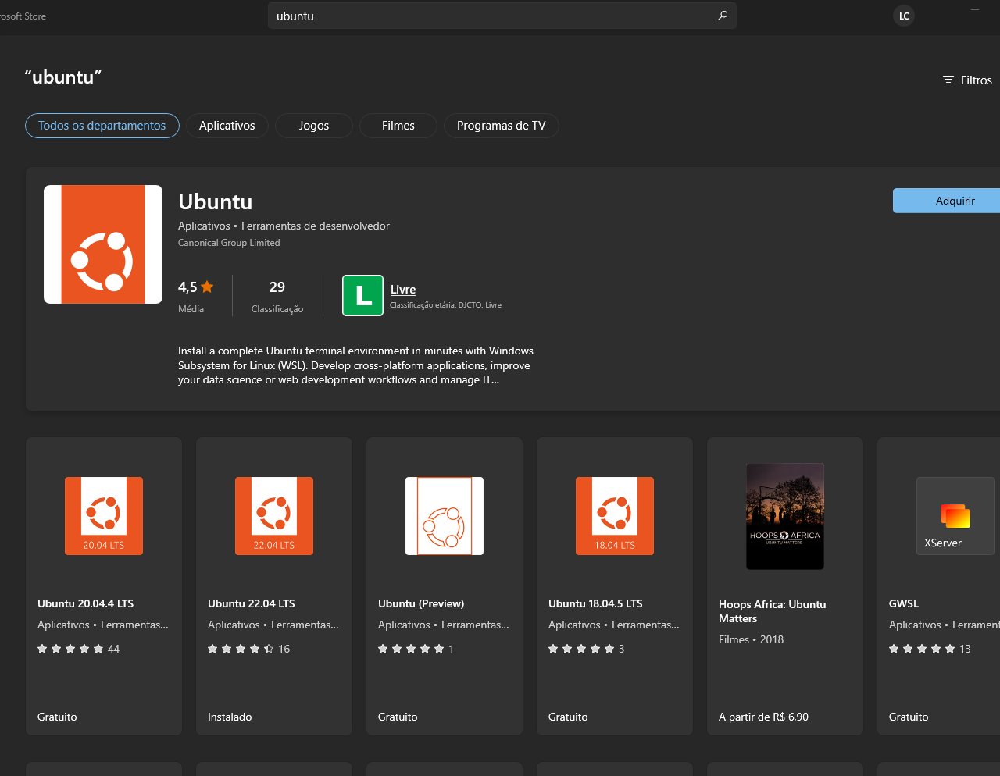
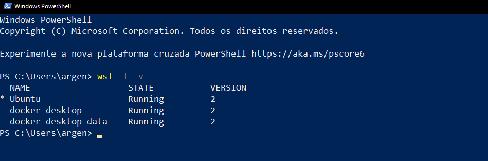

<p align="center">
  <a href="https://fullcycle.com.br/" target="blank"></a>
</p>

# WSL2 + Docker Quick Guide

*Read this in other language: [Portuguese](README.md)

## What is WSL2?

In 2016, Microsoft announced the possibility of running Linux within Windows 10 as a subsystem, and this was named **WSL** or **Windows Subsystem for Linux**.

Accessing the Windows 10 file system from Linux was simple and fast, but we did not have a complete execution of the Linux kernel, among other native artifacts, which made it impossible to execute various tasks in Linux, including Docker.

In 2019, Microsoft announced **WSL 2**, with an improved dynamic in relation to the 1st version.

* Complete execution of the Linux kernel.
* Improved performance for accessing files within Linux.
* Full system call compatibility.

WSL 2 was officially released on May 28, 2020.

With WSL 2, it is possible to run Docker on Linux using Windows 10/11.

Compare the versions: [https://docs.microsoft.com/pt-br/windows/wsl/compare-versions](https://docs.microsoft.com/pt-br/windows/wsl/compare-versions)


## What is Docker

Docker is an open source platform that enables packaging an application inside a container. An application can fit and run on any machine that has this technology installed.

## Why use WSL 2 + Docker for development

Configuring development environments on Windows has always been bureaucratic and complex, and the performance of some tools is not entirely satisfactory.

With the advent of Docker, this scenario has improved significantly, as we can set up our development environment based on Unix, independently and quickly, and still unify it with other operating systems.

Check out our **live about WSL 2 + Docker on the Full Cycle channel**: [https://www.youtube.com/watch?v=usF0rYCcj-E](https://www.youtube.com/watch?v=usF0rYCcj-E).


## Ways to use Docker on Windows

* [Docker Toolbox](#docker-toolbox).
* [Docker Desktop with Hyper-V](#docker-desktop-with-hyper-v).
* [Docker Desktop with WSL2](#docker-desktop-with-wsl2).
* [Docker Engine (Native Docker) directly installed on WSL2](#docker-engine-docker-native-directly-installed-on-wsl2).

### Docker Toolbox

Runs on top of Oracle's virtualization program, called **VirtualBox**. The performance of Docker Toolbox for many applications/tools can be very poor, making it impractical to use.

### Docker Desktop with Hyper-V

Runs on top of Microsoft's **Hyper-V** instead of using VirtualBox like Docker Toolbox. Docker Desktop with Hyper-V requires the **PRO** version of Windows 10/11, so you need to purchase it if you don't already have it.

Hyper-V tends to require a lot of machine resources, and although performance is better than Docker Toolbox, the machine may become slow to use for other things in Windows.

*Docker has announced that it will remove support for Hyper-V in the future.*

### Docker Desktop with WSL2

Runs on top of the **Virtual Machine Platform** instead of using VirtualBox or Hyper-V. Integrates with WSL2 allowing Docker to run within the Linux environment. No need to acquire a PRO license for Windows 10/11, has great performance, and consumes fewer resources compared to Docker Toolbox or Docker Desktop with Hyper-V.

We have the great advantage of working entirely within Linux for development, so using WSL2 + Docker is the best way to develop applications on Windows.

#### Advantages

* Simplifies Docker configuration in both Windows and WSL 2.
* Allows Docker to run outside WSL 2. Any shell such as PowerShell or DOS can be used.
* Supports Windows mode containers (images that contain Windows under the hood instead of Linux).
* Creates a centralized environment for storing images, volumes, and other Docker configurations. Multiple WSL 2 distributions can run the same Docker.
* Visual interface for Docker administration.

#### Disadvantages

* Initial memory usage without running any Docker containers can reach 3GB.
* Adds complex infrastructure to run Docker when only running Docker containers within WSL 2 is required.

### <a id="docker-engine-docker-native-directly-installed-on-wsl2"></a>Docker Engine (Native Docker) directly installed on WSL2

Docker Engine is the native Docker that runs in the Linux environment and is fully supported for WSL2. Its installation is identical to that described for Linux distributions provided on the [Docker](https://docs.docker.com/engine/install/ubuntu/) website.

#### Advantages

* It consumes the minimum amount of memory necessary to run the Docker daemon (Docker server).
* It is even faster than with Docker Desktop, as it runs directly within the WSL2 instance itself and not in a separate Linux instance.

#### Disadvantages

* It is necessary to run the command sudo service docker start every time WSL2 is restarted. This is not necessarily a disadvantage, but it is worth noting, and it will be resolved in the future with the inclusion of the /etc/wsl.conf file, which will allow commands to be executed every time WSL is restarted.
* If you need to run Docker in another WSL2 instance, you need to install Docker again in that instance or configure access to the desired Docker socket to share Docker between instances.
* It does not support containers in Windows mode.

## Minimum Requirements

* Windows 10 Home or Professional
  - Version 1903 or higher for x64 systems, with Build 18362 or higher.
  - Version 2004 or higher for ARM64 systems, with Build 19041 or higher.

* Windows 11 Home or Professional
  - Version 22000 or higher.

Your Windows version is likely already supported, but you can check this by accessing the `notification menu near the clock > All settings > System > About`. If it is not, use the Windows Update Assistant to update your Windows version.

* A machine compatible with virtualization (check availability according to your processor brand. If your machine is older, you may need to enable virtualization in the BIOS).
* At least 4GB of RAM.

## WSL 2 Installation

> ## Windows 10

### Enable Virtual Machine Platform

Execute the following commands in PowerShell as an administrator:
``` bash
dism.exe /online /enable-feature /featurename:Microsoft-Windows-Subsystem-Linux /all /norestart
dism.exe /online /enable-feature /featurename:VirtualMachinePlatform /all /norestart
```
Open PowerShell and type the command `wsl`, if it doesn't work, restart your machine.

### Install the WSL executable

Download the WSL 2 Kernel from this link: [https://docs.microsoft.com/pt-br/windows/wsl/wsl2-kernel](https://docs.microsoft.com/pt-br/windows/wsl/wsl2-kernel) and install the package.

### Set the default version of WSL to version 2

Version 1 of WSL is currently the default, set the default version to version 2, so all installed Linux distributions will already be set to version 2 by default. Run the following command in PowerShell:

``` bash
wsl --set-default-version 2
```

### (Optional) Changing a distribution from WSL 1 to version 2

If you already have WSL 1 on your machine and have just installed version 2, you can convert your WSL 1 Linux distribution to WSL 2. Run the following command in PowerShell:

``` bash
wsl --set-version <distribution name> 2
```

> ## Windows 11

Execute the command:

```bash
wsl --install
```

This command will install all WSL dependencies and install `Ubuntu` as the default Linux distribution.

If you want to install a different version of Ubuntu, run the command `wsl -l -o`, which will list all available Linux versions. Install the chosen version with the command `wsl --install -d distribution-name`.

We suggest Ubuntu (no version specified) as a popular distribution that comes with several tools pre-installed.

## Choose your Linux distribution in the Windows Store

It's also possible to install Linux distributions through the Windows Store. Choose your preferred Linux distribution in the Windows Store app, we suggest Ubuntu (without version) as it is a popular distribution and already comes with several tools installed by default.



When starting the installed Linux, you'll need to create a **username** which can be the same as your machine and a **password**, this will be the **root user of your WSL instance**.

Congratulations, your WSL2 is now working:


## (Optional) Use Windows Terminal as the default development terminal for Windows

A deficiency that Windows has always had is providing a suitable terminal for development. Now we have **Windows Terminal** built by Microsoft itself that allows running terminals in tabs, changing colors and themes, configuring shortcuts, and much more.

Install it from the Windows Store and use these [default settings](windows-terminal-settings.json) to enable WSL 2, Git Bash, the dracula theme, and some shortcuts.

To override the settings **click the down arrow next to the tabs and then click settings**, it will open the Windows Terminal settings, simply paste the contents of the JSON file and save, then click on `Ubuntu` in the `Profiles` section, click on Starting `Directory` and change the path to: `(\\wsl$\Ubuntu\home\YOUR_UBUNTU_USER)`.

## What resources can WSL 2 use from your machine

We can say that WSL 2 has almost complete access to your machine's resources. By default, it has access to:

* The entire hard disk.
* Complete use of processing resources.
* Use of 80% of available RAM.
* Use of 25% of available memory for SWAP.

This may not be desirable since WSL 2 can use virtually all of your machine's resources, but we can configure limits.

Create a file called `.wslconfig` in your user folder (C:\Users\<your_username>) and define these settings:

```txt
[wsl2]
memory=8GB
processors=4
swap=2GB
```
These are example limits and the most basic settings to be used, configure them according to your availability.
For more details, see this Microsoft documentation: [https://docs.microsoft.com/pt-br/windows/wsl/wsl-config#wsl-2-settings](https://docs.microsoft.com/pt-br/windows/wsl/wsl-config#wsl-2-settings).

To apply these settings, it is necessary to restart the Linux distributions, so we suggest running the command `wsl --shutdown` in PowerShell (this command will shut down all active WSL 2 instances, and you just need to reopen the terminal to use it with the new settings).

## Integrating Docker with WSL 2

At the beginning of this tutorial, we saw [4 ways to use Docker on Windows](#ways-to-use-docker-on-windows), but only 2 that we recommend:

* [Docker Engine (Docker Native) directly installed on WSL2.](#install-docker-with-docker-engine-native).
* [Docker Desktop with WSL2](#install-docker-with-docker-desktop).

We recommend choosing the 1st option for its benefits, since most people will be able to use WSL 2 as a central development tool. But in this tutorial, we will show both installation methods.


### <a id="install-docker-with-docker-engine-native"></a>1 - Install Docker with Docker Engine (Docker Native)

The installation of Docker on WSL 2 is identical to the installation of Docker on your own Linux distribution, so if you have Ubuntu, it's the same as Ubuntu, if it's Fedora, it's the same as Fedora. The installation documentation for Docker on Linux by distribution is [here](https://docs.docker.com/engine/install/), but let's see how to install it on Ubuntu.

> **For those who are migrating from Docker Desktop to Docker Engine, we have two options:**
> 1. Uninstall Docker Desktop.
> 2. Disable the Docker Desktop service in Windows services. This option allows you to use Docker Desktop if necessary, but for most users, uninstalling Docker Desktop is the recommended approach.
>If you choose the second option, you will need to delete the file ~/.docker/config.json and authenticate with Docker again using the command "docker login".

> **If you need to integrate Docker with IDEs other than VSCode**
>
> VSCode already integrates with Docker on WSL through the Remote WSL or Remote Container extension.
>
>You need to enable the connection to the Docker server via TCP. Here are the steps:
> 1. Create the file /etc/docker/daemon.json: sudo echo '{"hosts": ["tcp://0.0.0.0:2375", "unix:///var/run/docker.sock"]}' > /etc/docker/daemon.json
> 2. Restart Docker: `sudo service docker restart`
>
> After this procedure, go to your IDE and to connect to Docker, choose the TCP Socket option and put the URL `http://WSL-IP:2375`. Your WSL IP can be found with the command `cat /etc/resolv.conf`.
> 
> If it doesn't work, restart WSL with the command `wsl --shutdown` and start the Docker service again.

Install the prerequisites:

```
sudo apt update && sudo apt upgrade
sudo apt remove docker docker-engine docker.io containerd runc
sudo apt-get install \
    apt-transport-https \
    ca-certificates \
    curl \
    gnupg \
    lsb-release
```

Add the Docker repository to the list of sources in Ubuntu:

```
curl -fsSL https://download.docker.com/linux/ubuntu/gpg | sudo gpg --dearmor -o /usr/share/keyrings/docker-archive-keyring.gpg
echo \
  "deb [arch=amd64 signed-by=/usr/share/keyrings/docker-archive-keyring.gpg] https://download.docker.com/linux/ubuntu \
  $(lsb_release -cs) stable" | sudo tee /etc/apt/sources.list.d/docker.list > /dev/null
```

Intall Docker Engine

```
sudo apt-get update
```
```
sudo apt-get install docker-ce docker-ce-cli containerd.io docker-compose-plugin
```

Grant permission to run Docker with your current user:

```
sudo usermod -aG docker $USER
```

Start Docker service:

```
sudo service docker start
```


This above command will need to be executed every time Linux is restarted. If the Docker service is not running, it will show this error message when running the docker command:

```
Cannot connect to the Docker daemon at unix:///var/run/docker.sock. Is the docker daemon running?
```

The Docker Compose installed now will be in version 2, to run it instead of `docker-compose` use `docker compose`.

### Error starting Docker in Ubuntu 22.04

> If even after starting the Docker service, the following error or a similar one occurs:
>
> `Cannot connect to the Docker daemon at unix:///var/run/docker.sock. Is the docker daemon running?`
> Run the command `sudo update-alternatives --config iptables` and choose option 1 `iptables-legacy`
>
> Run `sudo service docker` start again. Run some Docker command such as `docker ps` to verify if it is working correctly. If it does not show the error above, it is OK.

#### Tip for Windows 11

In Windows 11, you can specify a default command to be executed whenever WSL is started. This allows us to automatically start the docker service. Edit the file `/etc/wsl.conf`:

Run the command to edit:

`sudo vim /etc/wsl.conf`

Press the letter `i` and paste the contents:

```conf
[boot]
command="service docker start" 
```
Press the `:` key, type `wq` to save/exit and press enter. Done, restart WSL with the `wsl --shutdown` command in DOS or PowerShell to test. After opening WSL again, type the `docker ps` command to check if the command doesn't return the following message: `Cannot connect to the Docker daemon at unix:///var/run/docker.sock. Is the docker daemon running?`

### <a id="install-docker-with-docker-desktop"></a>2 - Install Docker with Docker Desktop

Download in this link: [https://hub.docker.com/editions/community/docker-ce-desktop-windows](https://hub.docker.com/editions/community/docker-ce-desktop-windows) and install Docker Desktop.


Click on the `Docker icon near the clock -> Settings -> Settings at the top -> Resources -> WSL Integration`.

Enable `Enable integration with my default WSL distro` and enable your Linux version.


## Basic tips and tricks with WSL 2

* The performance of WSL 2 lies in running everything within Linux, so avoid running your projects with or without Docker from the path `/mnt/c`, as you will lose performance.
* To open the WSL terminal, simply type the distribution name in the Start menu or run `C:\Windows\System32\wsl.exe`.
* The Windows 10/11 file system is accessible at `/mnt`.

* The Linux file system can be accessed via the Windows network by typing `\\wsl$` in Windows Explorer.

* A folder in Windows Explorer can be accessed by typing the command ```explorer.exe .```.
* A folder or file can be opened with Visual Studio Code by typing the command ```code . or code myfile.ext```.
* Surprisingly, Windows executables can be accessed in the Linux terminal by running them with .exe at the end (does not mean they will work correctly).

* Some Linux graphical applications can be run with WSL 2. Read this tutorial: [https://medium.com/@dianaarnos/aplica%C3%A7%C3%B5es-gr%C3%A1ficas-no-wsl2-e0a481e9768c](https://medium.com/@dianaarnos/aplica%C3%A7%C3%B5es-gr%C3%A1ficas-no-wsl2-e0a481e9768c).
* Run the command ```wsl -l -v``` with PowerShell to see the installed Linux distributions and their current status (stopped or running).

* Run the command ```wsl --shutdown``` with PowerShell to shut down all running Linux distributions at the moment (when executing the command, Docker distributions will also be shut down and Docker Desktop will show a notification next to the clock asking if you want to start its distributions again, if you do not accept you will have to start Docker again with the icon near the Windows clock).
* Run the command ```wsl --t <distribution name>``` with PowerShell to shut down only a specific Linux distribution.
* If you notice that WSL 2 is consuming too many machine resources, execute the following commands within the WSL 2 terminal to free up RAM:
```bash
echo 1 | sudo tee /proc/sys/vm/drop_caches
```
* Add `export DOCKER_BUILDKIT=1` at the end of the .profile file of your Linux user to gain more performance when building with Docker. Run the command `source ~/.profile` to load this environment variable in your WSL 2 environment.
* If you want to automate the docker startup (other services can also be started), described in the disadvantages section of using native docker, while wsl.conf is not included, you can configure a task in Windows to run commands in WSL, see the following tutorial, [WSL 2: Run Ubuntu Services on Windows 10 Startup](https://techbrij.com/wsl-2-ubuntu-services-windows-10-startup), replacing the contents of the /etc/init-wsl file with one of the examples below:

Example of Docker service initialization:

```bash
#!/bin/sh
#Startup message
echo initializing services
#Start Docker service
service docker start
```

Example of generating a log on the Desktop:

```bash
#!/bin/sh
#Record the start date/time in the log
date +%d/%m/%Y%t%H:%M:%S >> /mnt/c/Users/your-windows-username/Desktop/wsl_start.log
#Record the startup message in the log
echo initializing services >> /mnt/c/Users/your-windows-username/Desktop/wsl_start.log
#Start the Docker service and record the result in the log
service docker start >> /mnt/c/Users/your-windows-username/Desktop/wsl_start.log
#Check the status of the Docker service and record the result in the log
service docker status >> /mnt/c/Users/your-windows-username/Desktop/wsl_start.log
```

* Unfortunately, if you manually restart the WSL, you will need to manually restart the services or run init-wsl manually. 
* In Windows 11, it is possible to start Docker automatically, see the section: [Tip for Windows 11](#tip-for-windows-11).

## Questions

* Does WSL 2 work with other virtual machines like **VirtualBox** or **VMWare**? Follow the [reference](https://docs.microsoft.com/pt-br/windows/wsl/wsl2-faq#will-i-be-able-to-run-wsl-2-and-other-3rd-party-virtualization-tools-such-as-vmware-or-virtualbox).