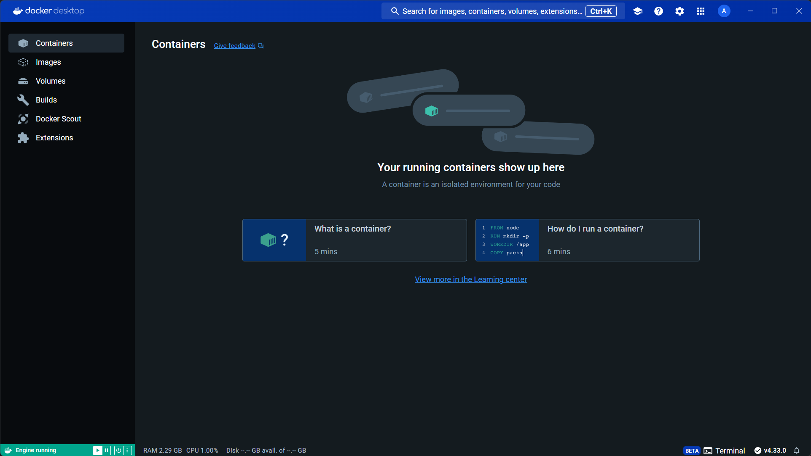
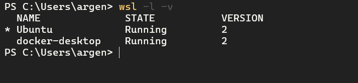
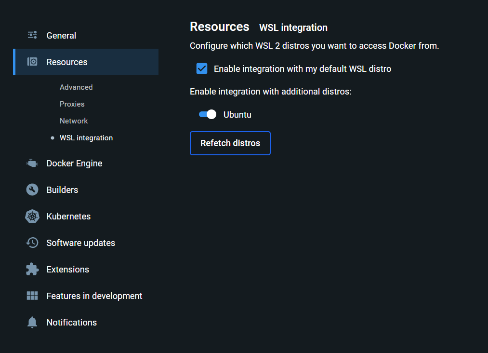
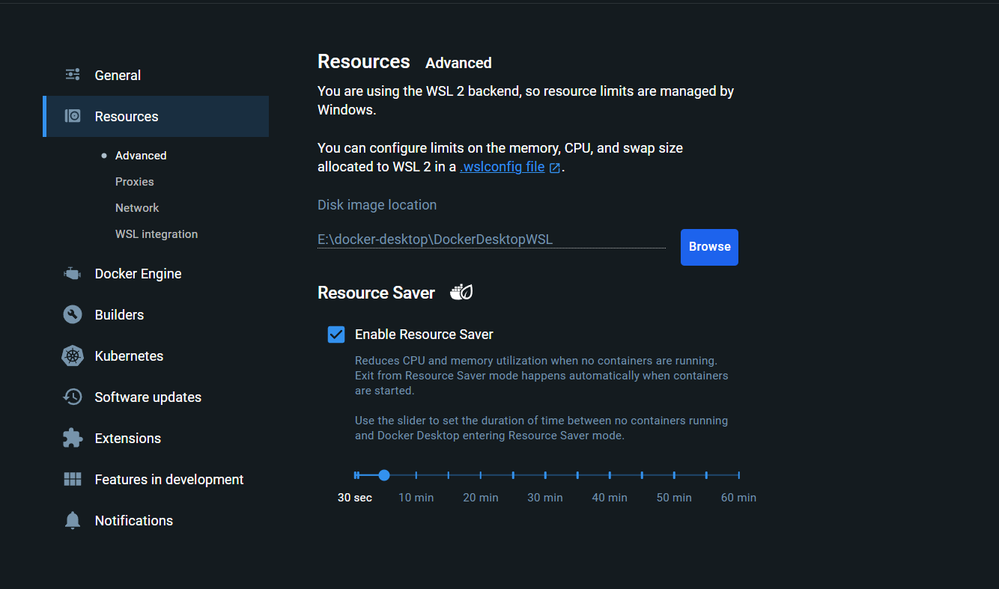
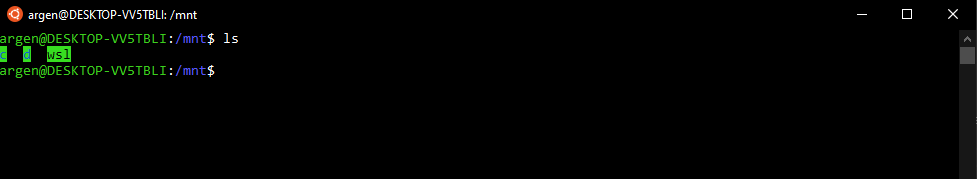

<p align="center">
  <a href="https://fullcycle.com.br/" target="blank"></a>
</p>

# Guia/Tutorial rápido do WSL2 + Docker

*Read this in other language: [English](README.en.md)

## Sumário

<details open>
  <summary>
    <strong>WSL</strong>
  </summary>

  - [O que é o WSL2](#o-que-é-o-wsl2)
  - [Requisitos mínimos](#requisitos-mínimos)
  - [Instalação do WSL 2](#instalação-do-wsl-2)
    - [Windows Update](#windows-update)
    - [Atualizar o WSL](#atualizar-o-wsl)
    - [Atribuir a versão default do WSL para a versão 2](#atribuir-a-versão-default-do-wsl-para-a-versão-2)
    - [Instale o Ubuntu](#instale-o-ubuntu)
    - [(Opcional) Alterar a versão de uma distribuição do Linux de WSL 1 para WSL 2](#opcional-alterar-a-versão-de-uma-distribuição-do-linux-de-wsl-1-para-wsl-2)
    - [Instalação do WSL 2 via Windows Store](#instalação-do-wsl-2-via-windows-store)
    - [Integração com VSCode](#integração-com-vscode)
  - [Windows Terminal como terminal padrão de desenvolvimento para Windows](#windows-terminal-como-terminal-padrão-de-desenvolvimento-para-windows)
  - [O que o WSL 2 pode usar de recursos da minha máquina?](#o-que-o-wsl-2-pode-usar-de-recursos-da-sua-máquina)
  - [Systemd](#systemd)
</details>

<details open>
  <summary>
    <strong>WSLg</strong>
  </summary>

  - [O que é WSLg](#o-que-é-wslg)
  - [Arquitetura do WSLg](#arquitetura-do-wslg)
  - [Como ativar o WSLg](#como-ativar-o-wslg)
</details>

<details open>
  <summary>
    <strong>Docker</strong>
  </summary>

  - [O que é o Docker](#o-que-é-docker)
  - [Porque usar WSL 2 + Docker para desenvolvimento](#porque-usar-wsl-2--docker-para-desenvolvimento)
  - [Modo de usar Docker no Windows](#modos-de-usar-docker-no-windows)
    - [1 - (Obsoleto) Docker Toolbox](#1-obsoleto-docker-toolbox)
    - [2 - (Obsoleto) Docker Desktop com Hyper-V](#2-obsoleto-docker-desktop-com-hyper-v)
    - [3 - Docker Desktop com WSL 2](#3-docker-desktop-com-wsl2)
      - [Vantagens](#docker-desktop-vantagens)
      - [Desvantagens](#docker-desktop-desvantagens)
    - [4 - Docker Engine (Docker Nativo) diretamente instalado no WSL2](#4-docker-engine-docker-nativo-diretamente-instalado-no-wsl2)
      - [Vantagens](#docker-engine-vantagens)
      - [Desvantagens](#docker-engine-desvantagens)
  - [Qual modo de usar Docker no Windows escolher?](#qual-modo-de-usar-docker-no-windows-escolher)
  - [Instalação do Docker](#instalação-do-docker)
    - [1 - Instalar o Docker com Docker Desktop](#1---instalar-o-docker-com-docker-desktop)
      - [Ativar o Docker na distribuição Linux](#ativar-o-docker-na-distribuição-linux)
      - [Otimizar recursos do Docker Desktop](#otimizar-recursos-do-docker-desktop)
      - [Aplicar autoMemoryReclaim no WSL 2](#aplicar-automemoryreclaim-no-wsl-2)
    - [2 - Instalar o Docker com Docker Engine (Docker Nativo)](#instalar-o-docker-com-docker-engine-docker-nativo)
      - [Erro ao iniciar o Docker no Ubuntu 22.04](#erro-ao-iniciar-o-docker-no-ubuntu-2204)
      - [Iniciar o Docker automaticamente no WSL](#iniciar-o-docker-automaticamente-no-wsl)
      - [Docker com Systemd](#docker-com-systemd) 
</details>


<details open>
  <summary>
    <strong>Dicas e truques</strong>
  </summary>

  - [Dicas e truques básicos com WSL 2](#dicas-e-truques-básicos-com-wsl-2)
    - [Performance ao usar o WSL 2](#performance-ao-usar-o-wsl-2)
    - [Windows Terminal](#windows-terminal)
    - [Acessar disco e outros dispositivos do Windows](#acessar-disco-e-outros-dispositivos-do-windows)
    - [Acessar o WSL 2 pelo Windows](#acessar-o-wsl-2-pelo-windows)
    - [Integração com VSCode](#integração-com-vscode)
    - [Executáveis do Windows no WSL 2](#executáveis-do-windows-no-wsl-2)
    - [Listando as distribuições Linux instaladas no WSL 2](#listando-as-distribuições-linux-instaladas-no-wsl-2)
    - [Parando todas as distribuições Linux no WSL 2](#parando-todas-as-distribuições-linux-no-wsl-2)
    - [Backup e restauração de distribuições Linux no WSL 2](#backup-e-restauração-de-distribuições-linux-no-wsl-2)
    - [Compactação do disco virtual do WSL 2](#compactação-do-disco-virtual-do-wsl-2)
    - [Rede em modo LAN e VPN](#rede-em-modo-lan-e-vpn)
    - [Ativar BuildKit no Docker](#ativar-buildkit-no-docker)
    - [Iniciar o Docker automaticamente no WSL 2](#iniciar-o-docker-automaticamente-no-wsl-2)
    - [Liberar memória RAM do WSL 2](#liberar-memória-ram-do-wsl-2)
    - [Arquivos .wslconfig e wsl.conf](#arquivos-wslconfig-e-wslconf)
    - [Expandir o disco virtual do WSL 2](#expandir-o-disco-virtual-do-wsl-2)
</details>

<details open>
  <summary>
    <strong>Dúvidas</strong>
  </summary>

  - [Dúvidas](#dúvidas)
      - [Preciso de uma licença PRO do Windows 10/11 para usar o WSL 2?](#preciso-de-uma-licença-pro-do-windows-1011-para-usar-o-wsl-2)
      - [Posso continuar desenvolvendo no Windows sem usar o WSL 2?](#posso-continuar-desenvolvendo-no-windows-sem-usar-o-wsl-2)
      - [O WSL 2 funciona junto com outras máquinas virtuais como VirtualBox ou VMWare?](#o-wsl-2-funciona-junto-com-outras-máquinas-virtuais-como-virtualbox-ou-vmware)
      - [É possível acessar aplicações rodando no WSL 2 pelo Windows?](#é-possível-acessar-aplicações-rodando-no-wsl-2-pelo-windows)
      - [É possível rodar aplicações gráficas no WSL 2?](#é-possível-rodar-aplicações-gráficas-no-wsl-2)
      - [Posso usar o WSL em cenários de produção?](#posso-usar-o-wsl-em-cenários-de-produção)
      - [Posso rodar o Docker Engine junto com o Docker Desktop?](#posso-rodar-o-docker-engine-junto-com-o-docker-desktop)
      - [Dúvidas sobre o Docker Desktop](#dúvidas-sobre-o-docker-desktop)
      - [Quer configurar um ambiente mais produtivo no Windows?](#quer-configurar-um-ambiente-mais-produtivo-no-windows)

</details>

## O que é o WSL2 

Em 2016, a Microsoft anunciou a possibilidade de rodar o Linux dentro do Windows 10 como um subsistema, isso foi chamado de **WSL** ou **Windows Subsystem for Linux**.

O acesso ao sistema de arquivos no Windows 10 pelo Linux era simples e rápido, porém não tínhamos uma execução completa do kernel do Linux, além de outros artefatos nativos e isto impossibilitava a execução de várias tarefas no Linux, uma delas é o Docker.

Em 2019, a Microsoft anunciou o **WSL 2**, com uma dinâmica aprimorada em relação à 1ª versão:

* Execução do kernel completo do Linux.
* Melhor desempenho para acesso aos arquivos dentro do Linux.
* Compatibilidade completa de chamada do sistema.

O WSL 2 foi lançado oficialmente no dia **28 de maio de 2020**.

Com WSL 2 é possível executar Docker e outras ferramentas que dependem do Kernel do Linux usando o Windows 10/11.

Compare as versões do WSL: [https://docs.microsoft.com/pt-br/windows/wsl/compare-versions](https://docs.microsoft.com/pt-br/windows/wsl/compare-versions)

---

## Requisitos mínimos

* **Windows 10 Home ou Professional**
  - Versão 2004 ou superior (Build 19041 ou superior).
  - Versões mais antigas requerem a instalação manual do WSL 2. Ver tutorial [https://learn.microsoft.com/en-us/windows/wsl/install-manual](https://learn.microsoft.com/en-us/windows/wsl/install-manual).

* **Windows 11 Home ou Professional**
  - Versão 22000 ou superior (qualquer Windows 11).

* Uma máquina compatível com virtualização (verifique a disponibilidade de acordo com a marca do seu processador. Se sua máquina for mais antiga pode ser necessária habilitá-la na BIOS).

* Pelo menos 4GB de memória RAM (Recomendado 8GB).

Provavelmente seu Windows já está na versão suportada, mas verifique isto acessando `Todas as Configurações > Sistema > Sobre`. Caso não esteja, use o Assistente do Windows Update para atualizar a sua versão do Windows.

> **É essencial manter o Windows atualizado, pois o WSL 2 depende de uma versão atualizada do Hyper-V. Verifique o Windows Update.**

---

## Instalação do WSL 2

Todas as instruções abaixo são para o Windows 10/11.

### Habilitar recursos do Windows (visualmente)

Antes de instalar ou atualizar o WSL, certifique-se de que os recursos necessários estejam ativados:

1. Pressione `Win + R`, digite `optionalfeatures` e pressione Enter.
2. Na janela “Recursos do Windows”, habilite:

   - Subsistema do Windows para Linux  
   - Plataforma de Máquina Virtual  
   - Hyper-V  

3. Clique em **OK** e reinicie o computador.

> Esses recursos são essenciais para o funcionamento do WSL 2 e para evitar erros como `Não foi possível iniciar a operação porque um recurso necessário não foi instalado.`.

---

### Verifique se já possui distribuições e a versão delas

Antes de trocar versões ou instalar novas distribuições, veja se o WSL 2 já está ativo e qual versão está sendo usada:

```bash
wsl -l -v
```

---

### Atualizar o WSL

Com a versão 2004 do Windows 10 ou qualquer versão do Windows 11, o WSL já estará presente em sua máquina. Para garantir que você está usando a versão mais recente do WSL, execute:

```bash
wsl --update
```

---

### Atribuir a versão default do WSL para a versão 2

A versão 2 normalmente é a default, mas a versão 1 do WSL pode estar como padrão. Execute o comando abaixo para definir como padrão a versão 2:

```bash
wsl --set-default-version 2
```

---

### Instale o Ubuntu

Execute o comando:

```bash
wsl --install
```

Este comando irá instalar o `Ubuntu` como o Linux padrão. 

Se quiser instalar uma versão diferente do Ubuntu, execute:

```bash
wsl --list --online
```

Instale a versão desejada com:

```bash
wsl --install -d nome-da-distribuicao
```

Sugerimos o Ubuntu (sem versão) por ser uma distribuição popular e que já vem com várias ferramentas úteis para desenvolvimento instaladas por padrão.

Após o término da instalação, será solicitado que você crie um **nome de usuário** (sem espaços ou caracteres especiais) e uma **senha**. Essa senha será usada para instalar pacotes e executar comandos como superusuário.

Para abrir o Ubuntu, digite `Ubuntu` no menu iniciar e clique no ícone.

---

### (Opcional) Alterar a versão de uma distribuição Linux de WSL 1 para WSL 2

Se você já tinha o WSL instalado antes e a distribuição está usando a versão 1, altere com:

```bash
wsl --set-version <distribution name> 2
```

---

Parabéns, seu WSL2 já está funcionando!


---

### Instalação do WSL 2 via Microsoft Store (alternativa)

Também é possível instalar distribuições Linux pela Microsoft Store. Basta abrir a loja e buscar pela distribuição desejada, como `Ubuntu`, e clicar em instalar.


---

### (Opcional) Recomendação de terminal

Recomendamos o uso do [Windows Terminal](https://docs.microsoft.com/pt-br/windows/terminal/get-started) como terminal padrão. Ele unifica PowerShell, CMD e Ubuntu em uma interface moderna e personalizável.


### Integração com VSCode

O Visual Studio Code tem uma extensão chamada **Remote - WSL** que permite acessar o WSL 2 diretamente do VSCode. Com esta extensão, você pode editar seus arquivos diretamente no WSL 2, rodar comandos, instalar extensões e muito mais.

Veja mais sobre esta extensão em [Remote - WSL](https://marketplace.visualstudio.com/items?itemName=ms-vscode-remote.remote-wsl).

Ao abrir um projeto que está dentro do Linux, é importante que o modo WSL do VSCode esteja ativado. No canto inferior esquerdo do VSCode, clique no botão `><` e selecione `Connect to WSL`. Isto irá conectar o VSCode ao WSL 2 e então poderá abrir o projeto que está dentro do Linux. Você verá que o botão `><` mudará para `WSL: Ubuntu`.


Se o VSCode não estiver desta forma ao abrir projetos dentro do Linux, então o modo WSL não estará ativado e você perderá performance ao editar arquivos dentro do Linux, além de não ter suporte para algumas extensões.

Outra forma de abrir o projeto no modo WSL, é acessando a pasta do projeto no terminal do WSL e digitando `code .`. Isto abrirá o VSCode no modo WSL.

## Windows Terminal como terminal padrão de desenvolvimento para Windows

Uma deficiência que o Windows sempre teve era prover um terminal adequado para desenvolvimento. Agora temos o **Windows Terminal** construído pela própria Microsoft que permite rodar terminais em abas, alterar cores e temas, configurar atalhos e muito mais.

Instale-o pelo Windows Store.

Veja mais opções de configuração dele em [Mais sobre o Windows Terminal](https://docs.microsoft.com/pt-br/windows/terminal/get-started).

Por padrão, o Windows Terminal vai identificar os principais shells instalados no Windows, como PowerShell, CMD e WSL.

## O que o WSL 2 pode usar de recursos da sua máquina

Podemos dizer que o WSL 2 tem acesso quase que total ao recursos de sua máquina. Ele tem acesso por padrão:

* A 1TB de disco rígido. É criado um disco virtual de 1TB para armazenar os arquivos do Linux (este limite pode ser expandido, ver a área de dicas e truques).
* A usar completamente os recursos de processamento.
* A usar 50% da memória RAM disponível.
* A usar 25% da memória disponível para SWAP (memória virtual).

Se você quiser personalizar estes limites, crie um arquivo chamado `.wslconfig` na raiz da sua pasta de usuário `(C:\Users\<seu_usuario>)` e defina estas configurações:

```conf
[wsl2]
memory=8GB
processors=4
```

Estes são limites de exemplo e as configurações mais básicas a serem utilizadas, configure-os às suas disponibilidades.


Para mais detalhes veja esta documentação da Microsoft: [https://learn.microsoft.com/pt-br/windows/wsl/wsl-config#configuration-setting-for-wslconfig](https://learn.microsoft.com/pt-br/windows/wsl/wsl-config#configuration-setting-for-wslconfig). Existem outras configurações que podem ser feitas, como configurações de rede, VPN, liberação de memória, etc.

Para aplicar estas configurações é necessário reiniciar as distribuições Linux. Execute o comando: `wsl --shutdown` (Este comando vai desligar todas as instâncias WSL 2 ativas, basta abrir o terminal novamente para usa-las já com as novas configurações).

Este arquivo `.wslconfig` é um arquivo de configuração global, ou seja, ele afetará todas as distribuições Linux que você tiver instalado no WSL 2, porque você pode ter mais de uma distribuição Linux instalada no WSL 2, como um Ubuntu, um Debian, um Fedora, etc.

## Systemd

O WSL é compatível com o `systemd`. O `systemd` é um sistema de inicialização e gerenciamento de serviços que é amplamente utilizado em distribuições Linux modernas. Ela permitirá que você use ferramentas mais complexas no Linux como snapd, LXD, etc.

Não é obrigatório ativa-lo e a qualquer momento ele pode ser desativado e reativado. Mas, recomendamos que o mantenha ativado, porque ele melhorará a compatibilidade com as distribuições Linux, permitindo que você use mais ferramentas e serviços, como Kubernetes, etc (Ele não é necessário para rodar o Docker).

Para ativa-lo, edite o arquivo `/etc/wsl.conf`:

Rode o comando para editar:

```conf
sudo vim /etc/wsl.conf
```

Aperte a letra `i` (para entrar no modo de inserção de conteúdo) e cole o conteúdo:

```conf
[boot]
systemd = true
```

Quando terminar a edição, pressione `Esc`, em seguida tecle `:` para entrar com o comando `wq` (salvar e sair) e pressione `enter`.

Toda vez que esta mudança for realizada é necessário reiniciar o WSL com o comando `wsl --shutdown` no DOS ou PowerShell.

## O que é WSLg

O WSLg é uma extensão do WSL 2 que permite rodar aplicações gráficas do Linux no Windows. Ele é uma extensão do WSL 2 e não é necessário instalar nada adicional, basta ter o WSL 2 instalado e atualizado.

Com ele é possível rodar aplicações como Chrome, Firefox, Gedit, IDEs (VSCode, JetBrains) e até aplicações gráficas feitas em Java, Python e etc.

### Arquitetura do WSLg

O WSLg é composto pelos componentes: Wayland, Weston, PulseAudio e CBL-Mariner.

Basicamente teremos o Wayland como servidor gráfico, o Weston como compositor, o PulseAudio para áudio e o CBL-Mariner como distribuição Linux para rodar as aplicações gráficas.


### Como ativar o WSLg

Para ativar o WSLg, basta ter o WSL 2 instalado e atualizado. Não é necessário instalar nada adicional.

Quando instalar algum aplicativo que dependente de interface gráfica, o WSLg será ativado automaticamente. Vamos a um exemplo:

```bash
sudo apt-get update

sudo apt-get install gedit
```

Abra o Gedit no terminal do WSL 2 digitando `gedit` e ele será aberto no Windows.

Portanto basta instalar o aplicativo e lança-lo no terminal do WSL 2 para que ele seja aberto no Windows.


## O que é Docker

Docker é uma plataforma open source que possibilita o empacotamento de uma aplicação dentro de um container. Uma aplicação consegue se adequar e rodar em qualquer máquina que tenha essa tecnologia instalada.

### Porque usar WSL 2 + Docker para desenvolvimento

Configurar ambientes de desenvolvimento no Windows sempre foi burocrático e complexo, além do desempenho de algumas ferramentas não serem totalmente satisfatórias.

Com o nascimento do Docker este cenário melhorou bastante, pois podemos montar nosso ambiente de desenvolvimento baseado em Unix, de forma independente e rápida, e ainda unificada com outros sistemas operacionais.

Veja nossa **live sobre WSL 2 + Docker no canal Full Cycle**: [https://www.youtube.com/watch?v=O33trWxqVC4](https://www.youtube.com/watch?v=O33trWxqVC4).


## Modos de usar Docker no Windows

* 1. *Obsoleto* [Docker Toolbox](#obsoleto-docker-toolbox)
* 2. *Obsoleto* [Docker Desktop com Hyper-V](#obsoleto-docker-desktop-com-hyper-v).
* 3. [Docker Desktop com WSL2](#docker-desktop-com-wsl2).
* 4. [Docker Engine (Docker Nativo) diretamente instalado no WSL2](#docker-engine-docker-nativo-diretamente-instalado-no-wsl2).

### 1. (Obsoleto) Docker Toolbox

Roda em cima do programa de virtualização de sistemas da Oracle, chamado de **VirtualBox**.
O desempenho do Docker Toolbox pode ser muito ruim, inviabilizando seu uso.

Pode ainda ser usado em Windows mais antigos, como XP, Vista, 7, 8 e 8.1.

### 2. (Obsoleto) Docker Desktop com Hyper-V

Roda em cima do **Hyper-V** da Microsoft em vez de usar o VirtualBox usando pelo Docker Toolbox. O Docker Desktop com Hyper-V necessita da versão **PRO** do Windows 10/11, portanto é necessário compra-la se você não a tem.

O Hyper-V costuma requerer muitos recursos da máquina e apesar do desempenho ser melhor que o Docker Toolbox, a máquina pode ficar lenta para se utilizar outras coisas no Windows.

### 3. Docker Desktop com WSL2

> Fizemos um overview completo do Docker Desktop, inclusive para outros sistemas operacionais também, veja [https://www.youtube.com/watch?v=99dCerRKO6s](https://www.youtube.com/watch?v=99dCerRKO6s)

Roda em cima do **Virtual Machine Platform** que é um componente do Hyper-V e Se integra com o WSL2 permitindo rodar o Docker dentro do ambiente do Linux. 

Não é necessário adquirir licença PRO do Windows 10/11.

Tem um grande desempenho e consome menos recursos quando comparado ao Docker Toolbox ou Docker Desktop com Hyper-V. 

#### <a id="docker-desktop-vantagens"></a> Vantagens

* Tem uma ferramenta visual para administrar o Docker.
* Permite instalar extensões para usar ferramentas diretas no Docker.
* Permite rodar um cluster Kubernetes localmente de forma fácil.
* Simplifica a configuração do Docker tanto no Windows quanto no WSL 2.
* Permite rodar o Docker fora do WSL 2, sendo possível usar qualquer shell como PowerShell ou DOS.
* Suporta containers em modo Windows (Imagens que contém Windows por debaixo dos panos ao invés de Linux).
* Como rodar outra instância de Linux separada da que usamos, implementa um ambiente de desenvolvimento mais isolado e mais segurança.
* Cria um ambiente centralizado para armazenamento de imagens, volumes e outras configurações Docker. Pode-se ter várias distribuições do WSL 2 rodando a mesma instância do Docker.

#### <a id="docker-desktop-desvantagens"></a> Desvantagens

* Uso de memória inicial sem rodar nenhum container Docker é de 1GB ou mais.
* Pode ser necessário reiniciar o Docker Desktop para que ele funcione corretamente em algumas situações.
* Tende a consumir mais recursos da máquina que o Docker Engine diretamente instalado no WSL 2.

### 4. Docker Engine (Docker Nativo) diretamente instalado no WSL2

O Docker Engine é o Docker nativo (como foi criado) que roda no ambiente Linux e completamente suportado para WSL 2. Sua instalação é idêntica a descrita para as próprias distribuições Linux disponibilizadas no site do [Docker](https://docs.docker.com/engine/install/ubuntu/).

É a maneira pura de usar o Docker no Linux.

#### <a id="docker-engine-vantagens"></a> Vantagens

* Consume menos memória para rodar o Docker Daemon (servidor do Docker) quando comparado ao Docker Desktop.
* Traz a experiência mais pura de usar o Docker no Linux.

#### <a id="docker-engine-desvantagens"></a> Desvantagens

* Se necessitar executar o Docker em outra instância do WSL 2, é necessário instalar novamente o Docker nesta instância ou configurar o acesso ao socket do Docker desejado para compartilhar o Docker entre as instâncias.
* Não suporta containers no modo Windows.
* Por enquanto o tamanho do VHDX (disco virtual onde é montando o Linux) não diminui automaticamente usando o modo sparse do WSL (modo compactação automática) quando se exclui os artefatos do Docker (containers, imagens, volumes, layers). Dependendo do tamanho do disco virtual, pode ser necessário compacta-lo manualmente de tempos em tempos.
* Pode trazer mais riscos de segurança ao Linux, pois o Docker Engine é um software que roda diretamente no Linux e ao rodar imagens de terceiros, pode haver riscos de segurança.

## Qual modo de usar Docker no Windows escolher?

As 2 primeiras opções são obsoletas e não recomendamos seu uso. As 2 últimas opções são as mais recomendadas.

O uso do **Docker Desktop** como explicado na seção [Docker Desktop com WSL2](#3-docker-desktop-com-wsl2) é recomendado para a maioria dos usuários, pois é mais fácil de usar e tem uma interface gráfica para administrar o Docker, entretanto consome mais recursos da máquina, principalmente memória RAM. Com 8GB, o Docker Desktop pode não ser a melhor opção. Pode ser que 16GB pode ser o ideal para rodar o Docker Desktop, na sua máquina.

Você pode testar o Docker Desktop e se não gostar, se ver que está consumindo muitos recursos, pode desinstala-lo e instalar o Docker Engine diretamente no WSL 2.
O Docker Desktop tem um indicador de uso de memória RAM e CPU, acompanhe-o durante alguns dias para ver se está consumindo muitos recursos. Mais abaixo, vamos mostrar como otimizar os recursos consumidos pelo Docker Desktop, usando o Resource Save Mode.

## Instalação do Docker

### 1 - Instalar o Docker com Docker Desktop

Baixe neste link: [https://www.docker.com/products/docker-desktop/](https://www.docker.com/products/docker-desktop/) e instale o Docker Desktop.

Logo após a instalação, será pedido para logar com sua conta do Docker. Faça o login (crie uma conta se não tiver) e siga as instruções.

Ao final da instalação, o Docker Desktop estará instalado e rodando. Você pode ver o ícone do Docker perto do relógio do Windows. Ele ficará rodando em segundo plano. A interface do Docker Desktop deverá ficar assim:



Podemos ver agora que há 2 distribuições Linux rodando no WSL 2, uma é a distribuição padrão do Ubuntu (ou a que você instalou) e a outra é a distribuição do Docker Desktop. Rode o comando `wsl -l -v` para ver as distribuições Linux instaladas e seu status atual.



#### Ativar o Docker na distribuição Linux

Para o Docker funcionar na sua distribuição Linux, você precisa ativa-lo no painel do Docker Desktop. Abra a interface do Docker Desktop, clique no ícone de engrenagem no canto superior direito, vá em `Resources -> WSL Integration` e habilite a distribuição Linux que você deseja usar o Docker, e clique em `Apply & Restart`, conforme a imagem abaixo:



#### Otimizar recursos do Docker Desktop

Existe um recurso no Docker Desktop chamado **Resource Save Mode** que otimiza o uso de recursos da máquina. Ele diminui o uso de memória RAM e CPU quando o Docker Desktop não está sendo usado.

De tempos em tempos, o Docker Desktop vai analisar já há containers rodando e se não houver, ele vai diminuir o uso de recursos da máquina.

Ative-o, clicando no ícone de engrenagem no canto superior direito, vá em `Resources -> Advanced` e habilite a opção `Resource Save Mode`, conforme a imagem abaixo:



Você pode escolher de quanto em quanto tempo o Docker Desktop vai analisar se há containers rodando e diminuir o uso de recursos da máquina. O padrão é 5 min.

#### Aplicar autoMemoryReclaim no WSL 2

Com o passar do tempo, o WSL pode consumir memória RAM e não liberar, é feito cache de memória para melhorar o desempenho, mas podemos liberar esta memória depois de um tempo. Esta opção é chamada de `autoMemoryReclaim`, ela libera a memória RAM que não está sendo usada através de uma das 2 opções:

* gradual: Libera a memória RAM de forma gradual de 5 em 5 minutos.
* dropcache: Libera a memória RAM de forma imediata.

Para ativar o `autoMemoryReclaim`, edite o arquivo `.wslconfig`:

```conf
[experimental]
autoMemoryReclaim=gradual
```

Esta opção só funcionará após reiniciar o WSL com o comando `wsl --shutdown`.

> Não use esta opção se estiver usando o Docker Engine, porque isto causará problemas no Docker Engine. Utilize apenas se estiver usando o Docker Desktop ou se não tiver o Docker instalado.

### <a id="instalar-o-docker-com-docker-engine-docker-nativo"></a>2 - Instalar o Docker com Docker Engine (Docker Nativo)

A instalação do Docker no WSL 2 é idêntica a instalação do Docker em sua própria distribuição Linux, portanto se você tem o Ubuntu é igual ao Ubuntu, se é Fedora é igual ao Fedora. A documentação de instalação do Docker no Linux por distribuição está [aqui](https://docs.docker.com/engine/install/), mas vamos ver como instalar no Ubuntu.


> **Quem está migrando de Docker Desktop para Docker Engine, temos duas opções**
> 1. Desinstalar o Docker Desktop.
> 2. Desativar o Docker Desktop Service nos serviços do Windows. Esta opção permite que você utilize o Docker Desktop, se necessário, para a maioria dos usuários a desinstalação do Docker Desktop é a mais recomendada.
>Se você escolheu a 2º opção, precisará excluir o arquivo ~/.docker/config.json e realizar a autenticação com Docker novamente através do comando "docker login"

> **Se necessitar integrar o Docker com outras IDEs que não sejam o VSCode**
>
> O VSCode já se integra com o Docker no WSL desta forma através da extensão Remote WSL ou Remote Container.
> 
> É necessário habilitar a conexão ao servidor do Docker via TCP. Vamos aos passos:
> 1. Crie o arquivo /etc/docker/daemon.json: `sudo echo '{"hosts": ["tcp://0.0.0.0:2375", "unix:///var/run/docker.sock"]}' > /etc/docker/daemon.json`
> 2. Reinicie o Docker: `sudo service docker restart`
> 
> Após este procedimento, vá na sua IDE e para conectar ao Docker escolha a opção TCP Socket e coloque a URL `http://IP-DO-WSL:2375`. Seu IP do WSL pode ser encontrado com o comando `cat /etc/resolv.conf`.
> 
> Se caso não funcionar, reinicie o WSL com o comando `wsl --shutdown` e inicie o serviço do Docker novamente.


Execute os comandos:

```
sudo apt-get update
sudo apt-get install ca-certificates curl
sudo install -m 0755 -d /etc/apt/keyrings
sudo curl -fsSL https://download.docker.com/linux/ubuntu/gpg -o /etc/apt/keyrings/docker.asc
sudo chmod a+r /etc/apt/keyrings/docker.asc

echo \
  "deb [arch=$(dpkg --print-architecture) signed-by=/etc/apt/keyrings/docker.asc] https://download.docker.com/linux/ubuntu \
  $(. /etc/os-release && echo "$VERSION_CODENAME") stable" | \
  sudo tee /etc/apt/sources.list.d/docker.list > /dev/null
sudo apt-get update

sudo apt-get install docker-ce docker-ce-cli containerd.io docker-buildx-plugin docker-compose-plugin
```

Adicione o repositório do Docker na lista de sources do Ubuntu:

```
curl -fsSL https://download.docker.com/linux/ubuntu/gpg | sudo gpg --dearmor -o /usr/share/keyrings/docker-archive-keyring.gpg
echo \
  "deb [arch=amd64 signed-by=/usr/share/keyrings/docker-archive-keyring.gpg] https://download.docker.com/linux/ubuntu \
  $(lsb_release -cs) stable" | sudo tee /etc/apt/sources.list.d/docker.list > /dev/null
```

> OBSERVAÇÃO: Se você estiver usando uma distribuição diferente do Ubuntu, veja os comandos de instalação no documentação do Docker [https://docs.docker.com/engine/install/](https://docs.docker.com/engine/install/)

Dê permissão para rodar o Docker com seu usuário corrente:

```
sudo usermod -aG docker $USER
```

Reiniciar o WSL via linha de comando do Windows para que não seja necessário autorização root para rodar o comando docker:

```
wsl --shutdown
```


Acessar novamente o Ubuntu e iniciar o serviço do Docker:

```
sudo service docker start
```

Este comando acima terá que ser executado toda vez que o Linux for reiniciado. Se caso o serviço do Docker não estiver executando, mostrará esta mensagem de erro ao rodar comando `docker`:

```
Cannot connect to the Docker daemon at unix:///var/run/docker.sock. Is the docker daemon running?
```

#### Erro ao iniciar o Docker no Ubuntu 22.04

> Se mesmo ao iniciar o serviço do Docker acontecer o seguinte erro ou similar:
>
> `Cannot connect to the Docker daemon at unix:///var/run/docker.sock. Is the docker daemon running?`
> Rode o comando `sudo update-alternatives --config iptables` e escolha a opção 1 `iptables-legacy`
>
> Rode novamente o `sudo service docker start`. Rode algum comando Docker como `docker ps` para verificar se está funcionando corretamente. Se não mostrar o erro acima, está ok.


#### Iniciar o Docker automaticamente no WSL

> **Apenas para Windows 11 ou Windows 10 com o update KB5020030**

É possível especificar um comando padrão para ser executados sempre que o WSL for iniciado, isto permite que já coloquemos o serviço do docker para iniciar automaticamente. Edite o arquivo `/etc/wsl.conf`:

Rode o comando para editar:

```conf
sudo vim /etc/wsl.conf
```

Aperte a letra `i` (para entrar no modo de inserção de conteúdo) e cole o conteúdo:

```conf
[boot]
command = service docker start
```

#### Docker com Systemd

Caso tenha ativado o systemd, na maioria dos casos o Docker iniciará automaticamente, portanto se você se tem a linha `command = service docker start` no `/etc/wsl.conf`, comente-a com `#` e reinicie o WSL com o comando `wsl --shutdown`.

Caso contrário, você pode inicia-lo automaticamente usando os comandos:

```bash
sudo systemctl enable docker.service
sudo systemctl enable containerd.service
```

É necessário reiniciar o WSL com o comando `wsl --shutdown` para que as mudanças tenham efeito.

Pronto, basta reiniciar o WSL com o comando `wsl --shutdown` no DOS ou PowerShell para testar. Após abrir o WSL novamente, digite o comando `docker ps` para avaliar se o comando não retorna a mensagem acima: `Cannot connect to the Docker daemon at unix:///var/run/docker.sock. Is the docker daemon running?`

## Dicas e truques básicos com WSL 2

### Performance ao usar o WSL 2

A performance do WSL 2 está em se executar tudo dentro do Linux, por isso evite executar seus projetos com ou sem Docker do caminho `/mnt/c`, pois você perderá performance. O ideal é executar tudo dentro do Linux, no caminho `/home/seu_usuario`.

A ideia é você pegar todos os seus projetos que estão no C: e copia-los para o Linux, no `/home/seu_usuario`. Assim, tudo estará dentro do Linux e a performance será melhor.

A princípio a ideia de fazer tudo no Linux pode parecer estranha, mas é a melhor forma de se obter performance com o WSL 2.

### Windows Terminal

O Windows Terminal é um terminal que agrega vários terminais em uma única janela, como PowerShell, CMD e WSL. Ele permite personalização de cores, temas, atalhos e muito mais.

Instale-o pelo Windows Store.

A experiência de usar o Windows Terminal é muito melhor que o terminal padrão do Windows, use ele para desenvolver no Windows e também para acessar o WSL 2.

### Acessar disco e outros dispositivos do Windows

O WSL 2 tem acesso a todo o disco rígido do Windows, basta acessar o caminho `/mnt/c` para acessar o disco C: do Windows. Se você tiver mais discos, eles estarão disponíveis em `/mnt/d`, `/mnt/e`, etc.

O `/mnt` é um ponto de montagem do Linux, onde ele monta os dispositivos do Windows.



### Acessar o WSL 2 pelo Windows

É possível acessar o WSL 2 pelo Windows Explorer, basta digitar `\\wsl.localhost$` na barra de endereços e será mostrado as distribuições Linux instaladas no WSL 2.

Também é possível acessar pelo ícone `Linux` que fica do lado esquerdo do Windows Explorer. Talvez sua versão do Windows não tenha este ícone, então use o caminho `\\wsl.localhost$`.


Também é possível de dentro do Linux abrir uma pasta no Windows Explorer, basta digitar o comando `explorer.exe .` e a pasta atual será aberta no Windows Explorer.

### Integração com VSCode

O Visual Studio Code tem uma extensão chamada **Remote - WSL** que permite acessar o WSL 2 diretamente do VSCode. Com esta extensão, você pode editar seus arquivos diretamente no WSL 2, rodar comandos, instalar extensões e muito mais.

Veja mais sobre esta extensão em [Remote - WSL](https://marketplace.visualstudio.com/items?itemName=ms-vscode-remote.remote-wsl).

Ao abrir um projeto que está dentro do Linux, é importante que o modo WSL do VSCode esteja ativado. No canto inferior esquerdo do VSCode, clique no botão `><` e selecione `Connect to WSL`. Isto irá conectar o VSCode ao WSL 2 e então poderá abrir o projeto que está dentro do Linux. Você verá que o botão `><` mudará para `WSL: Ubuntu`.


Se o VSCode não estiver desta forma ao abrir projetos dentro do Linux, então o modo WSL não estará ativado e você perderá performance ao editar arquivos dentro do Linux, além de não ter suporte para algumas extensões.

Outra forma de abrir o projeto no modo WSL, é acessando a pasta do projeto no terminal do WSL e digitando `code .`. Isto abrirá o VSCode no modo WSL.

### Executáveis do Windows no WSL 2

É possível executar executáveis do Windows no WSL 2, basta digitar o caminho completo do executável do Windows no terminal do WSL 2. Por exemplo, para executar o executável `notepad.exe` do Windows, basta digitar `notepad.exe` no terminal do WSL 2.


### Listando as distribuições Linux instaladas no WSL 2

Para listar as distribuições Linux instaladas no WSL 2, execute o comando `wsl -l -v` no terminal do Windows.

### Parando todas as distribuições Linux no WSL 2

Para parar todas as distribuições Linux que estão rodando no WSL 2, execute o comando `wsl --shutdown` no terminal do Windows.

Se você quiser parar somente uma distribuição Linux específica, execute o comando `wsl --t <distribution name>`.


> Se estiver usando o Docker Desktop, ao executar o comando `wsl --shutdown`, o Docker Desktop irá parar também e será necessário reinicia-lo novamente.

* É possível executar algumas aplicações gráficas do Linux com WSL 2. Leia este tutorial: [https://medium.com/@dianaarnos/aplica%C3%A7%C3%B5es-gr%C3%A1ficas-no-wsl2-e0a481e9768c](https://medium.com/@dianaarnos/aplica%C3%A7%C3%B5es-gr%C3%A1ficas-no-wsl2-e0a481e9768c).
* Execute o comando ```wsl -l -v``` com o PowerShell para ver as versões de Linux instaladas e seu status atual(parado ou rodando).

### Backup e restauração de distribuições Linux no WSL 2

É possível fazer backup e restauração de distribuições Linux no WSL 2. Isto é interessante, porque tudo que você estiver fazendo no Linux, como instalação de pacotes, configurações, etc, estará salvo no backup e poderá ser restaurado onde quiser.

Para fazer backup de uma distribuição Linux, execute o comando:

```bash
wsl --export Ubuntu C:\caminho\backup.vhdx --vhd
```

Onde `Ubuntu` é o nome da distribuição Linux que você quer fazer backup e `C:\caminho\backup.vhdx` é o caminho onde o backup será salvo. A opção `--vhd` é para salvar o backup em formato VHD, isto facilitar a restauração e ainda é possível monta-lo como um disco rígido no Windows, se quiser.

Dependendo do tamanho do disco virtual, o backup pode demorar um pouco.

Para restaurar uma distribuição Linux, execute o comando:

```bash
wsl --import-in-place Ubuntu C:\caminho\backup.vhdx
```

Onde `Ubuntu` é o nome da distribuição Linux (pode ser o nome que você quiser) que você quer restaurar e `C:\caminho\backup.vhdx` é o caminho onde o backup foi salvo.

Normalmente os VHDX são salvos em `C:\Users\<seu_usuario>\AppData\Local\Packages\CanonicalGroupLimited...\LocalState\`, mas, uma vez que você tenho restaurado a distribuição Linux, você pode mover o VHDX para onde quiser. Será o caminho que você passar no comando `wsl --import-in-place`. 


### Compactação do disco virtual do WSL 2

O disco virtual do WSL 2 é um arquivo VHDX que cresce conforme você vai usando o Linux. Se você excluir arquivos, o disco virtual não diminuirá automaticamente, ele continuará com o mesmo tamanho. 

Para diminuir ative o modo `sparse` do WSL 2, que é a compactação automática do disco virtual. Para ativar, edite o arquivo `.wslconfig`:

```conf
[wsl2]
sparseVhd=true
```

Esta opção só funcionará para novos discos virtuais.

Para os discos virtuais já criados, execute o comando:

```bash
wsl --manage "Ubuntu" --set-sparse true
wsl --manage "docker-desktop" --set-sparse true # Se estiver usando o Docker Desktop
```

Isto irá converter o disco virtual para o modo sparse, que é a compactação automática do disco virtual.

Antes de executar o comando, verifique se a distribuição Linux está parada, execute o comando `wsl --shutdown` para parar todas as distribuições Linux.

Se você já tinha uma distribuição antiga e após aplicar o modo sparse, o disco virtual não diminuiu, você pode compacta-lo manualmente.

Use a ferramenta [wslcompact](https://github.com/okibcn/wslcompact) para realizar este procedimento. Basicamente esta ferramenta será um executável ativo no `PowerShell` e ao executá-lo ele irá exportar e importar o disco virtual, forçando o WSL a compacta-lo.

Execute o comando:

```bash
wslcompact -c Ubuntu
```

Será gerado um novo disco virtual chamado de `ext4.vhdx` que será sua distribuição compactada. Quando o executável pedir para registrar o disco, coloque `Y` e pressione `Enter`, isto não fará ele registrar, você deverá fazer isto manualmente como foi mostrado na seção de backup e restauração deste tutorial.

Remova o disco antigo com o comando `wsl --unregister Ubuntu` e registre o novo disco com o comando `wsl --import-in-place Ubuntu C:\caminho\ext4.vhdx`.

> Cuidado: Faça um backup da sua distribuição Linux antes de compacta-la, pois você pode cometer um erro e perder seu Linux.


### Rede em modo LAN e VPN

Como o WSL é virtualizado, há uma outra interface de rede, por isso se você usa rede LAN (cabeada), ao rodar aplicações e tentar acessar pelo navegador, por exemplo, você não conseguirá acessar. Seria necessário ficar fazendo binding de portas o que não seria produtivo.

Eventualmente, podemos ter problemas com VPNs, pois o WSL 2 tem uma interface de rede própria e a VPN pode não funcionar corretamente.

Para resolver isto, ative o modo `mirrored` da rede do WSL 2, que fará com que a interface de rede do WSL 2 seja a mesma do Windows. Edite o arquivo `.wslconfig`:

```conf
[wsl2]
networkingMode=mirrored
```

Esta opção só funcionará após reiniciar o WSL com o comando `wsl --shutdown`.

Esta opção ajuda a melhorar a experiência com o uso de VPNs.

### Ativar BuildKit no Docker

> **Apenas para Docker Engine**

Acrescente `export DOCKER_BUILDKIT=1` no final do arquivo `.profile` do seu usuário do Linux ou em seu arquivo de terminal personalizado para ganhar mais performance ao realizar builds com Docker. Execute o comando `source ~/.profile` para carregar esta variável de ambiente no ambiente do seu WSL 2.

### Iniciar o Docker automaticamente no WSL 2

> **Apenas para Windows 11 ou Windows 10 com o update KB5020030**
> **Apenas para Docker Engine**
> **Apenas para quem não ativou o systemd**

É possível especificar um comando padrão para ser executados sempre que o WSL for iniciado, isto permite que já coloquemos o serviço do docker para iniciar automaticamente. Edite o arquivo `/etc/wsl.conf`:

Rode o comando para editar:

```conf
sudo vim /etc/wsl.conf
```

Aperte a letra `i` (para entrar no modo de inserção de conteúdo) e cole o conteúdo:

```conf
[boot]
command = service docker start
```

### Liberar memória RAM do WSL 2

Se verificar que o WSL 2 está consumindo muitos recursos da máquina, execute o seguinte comando dentro do terminal WSL 2 para liberar memória RAM:

```bash
echo 1 | sudo tee /proc/sys/vm/drop_caches
```

Este método é agressivo, porque libera instantaneamente a memória RAM, mas pode ser necessário em alguns casos.

> Não use a opção abaixo opção se não estiver usando o Docker Engine. Pode ser utilizado com o Docker Desktop ou se não tiver o Docker instalado.

O WSL possui um recurso chamado `autoMemoryReclaim` que libera a memória RAM que não está sendo usada de forma automática. 

Há 2 opções para o `autoMemoryReclaim`:

* gradual: Libera a memória RAM de forma gradual de 5 em 5 minutos.
* dropcache: Libera a memória RAM de forma imediata.

Edite o arquivo `.wslconfig`:

```conf
[experimental]
autoMemoryReclaim=gradual
```

Caso queria uma opção de liberação de memória automática e estiver usando o Docker Engine, coloque o seguinte script para rodar no WSL: [https://gist.github.com/craigloewen-msft/496078591e0bbbfdec9f144c6b50a8cc](https://gist.github.com/craigloewen-msft/496078591e0bbbfdec9f144c6b50a8cc). Por padrão, ele vai rodar de 2 em 2 minutos, mas você pode alterar o tempo de execução.

### Arquivos .wslconfig e wsl.conf

O arquivo `.wslconfig` é um arquivo de configuração global, ou seja, ele afetará todas as distribuições Linux que você tiver instalado no WSL 2, porque você pode ter mais de uma distribuição Linux instalada no WSL 2, como um Ubuntu, um Debian, um Fedora, etc.

O arquivo `wsl.conf` é um arquivo de configuração específico de uma distribuição Linux, ou seja, ele afetará somente a distribuição Linux que você especificar no arquivo `wsl.conf`.

Existem algumas opções que podem ser usadas no arquivo `.wslconfig` e `wsl.conf`, veja a documentação oficial [https://docs.microsoft.com/pt-br/windows/wsl/wsl-config](https://docs.microsoft.com/pt-br/windows/wsl/wsl-config).

> Estas opções pode ajudar em como o WSL 2 se comporta, como alocar mais memória RAM, mais CPUs, etc. As configurações mais básicas já foram mostradas na parte de instalação do WSL, na parte de instalação do Docker e também nesta seção de Dicas e trues.

Esta opção só funcionará após reiniciar o WSL com o comando `wsl --shutdown`.

### Expandir o disco virtual do WSL 2

Por padrão o disco virtual do WSL 2 é de 1TB, mas se você precisar de mais espaço, é possível expandir o disco virtual. 

Uma maneira simples de verificar o tamanho do disco é rodar o seguinte comando no PowerShell ou DOS:

```bash
wsl --system -d <distribution-name> df -h /mnt/wslg/distro
```

Utilize o `diskpart` do Windows para expandir o tamanho dele, siga este tutorial: [https://learn.microsoft.com/en-us/windows/wsl/disk-space#how-to-expand-the-size-of-your-wsl-2-virtual-hard-disk](https://learn.microsoft.com/en-us/windows/wsl/disk-space#how-to-expand-the-size-of-your-wsl-2-virtual-hard-disk)


## Dúvidas

### Preciso de uma licença PRO do Windows 10/11 para usar o WSL 2?

Não, o WSL 2 é suportado em todas as versões do Windows 10/11, desde que estejam atualizadas.

### Posso continuar desenvolvendo no Windows sem usar o WSL 2?

Sim, você pode continuar desenvolvendo no Windows sem usar o WSL 2, mas o WSL 2 traz uma experiência de desenvolvimento mais próxima do Linux, com melhor desempenho e mais recursos.

A não ser que você tenha uma necessidade específica de desenvolver no Windows, como desenvolver aplicações usando .Net, por exemplo, provavelmente sua aplicação rodará no Linux, então, o WSL 2 é a melhor opção quando se quer continuar a usar o Windows, usando Linux, mas sem dual boot ou máquina virtual.

### O WSL 2 funciona junto com outras máquinas virtuais como VirtualBox ou VMWare?

O WSL 2 funciona junto com outras máquinas virtuais como **VirtualBox** ou **VMWare**? Siga a [referência](https://learn.microsoft.com/pt-br/windows/wsl/faq#poderei-executar-o-wsl-2-e-outras-ferramentas-de-virtualiza--o-de-terceiros--como-vmware-ou-virtualbox-)

### É possível acessar aplicações rodando no WSL 2 pelo Windows?

Sim, é possível acessar aplicações rodando no WSL 2 pelo Windows, basta acessar o endereço `localhost` no navegador do Windows. O WSL 2 tem uma interface de rede própria e o Windows consegue acessar aplicações rodando no WSL 2.

### É possível rodar aplicações gráficas no WSL 2?

Sim, este o projeto WSLg (Windows Subsystem for Linux GUI) que permite rodar aplicações gráficas no WSL 2. Veja mais sobre isto no topo do tutorial

### Posso usar o WSL em cenários de produção?

O WSL é uma ferramenta de desenvolvimento e não é recomendado para uso em produção.

### Posso rodar o Docker Engine junto com o Docker Desktop?

Não, só é possível rodar um de cada vez. É até possível ter os dois instalados, mas só um pode ser executado por vez.

### Dúvidas sobre o Docker Desktop

Fizemos um overview completo do Docker Desktop, inclusive para outros sistemas operacionais também, veja [https://www.youtube.com/watch?v=99dCerRKO6s](https://www.youtube.com/watch?v=99dCerRKO6s)

### Quer configurar um ambiente mais produtivo no Windows?

Acesse os tutorias abaixo:

- Configuração de ambiente de desenvolvimento produtivo: [https://github.com/argentinaluiz/ambiente-dev-produtivo](https://github.com/argentinaluiz/ambiente-dev-produtivo)
- Como montar um ambiente produtivo no VSCode: [https://github.com/argentinaluiz/my-vscode-settings](https://github.com/argentinaluiz/my-vscode-settings)
